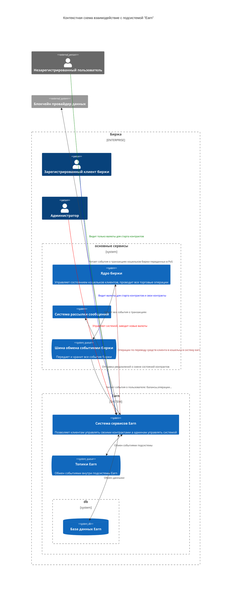

mermaid не очень хорошо биндит текст к стелкам
и пока не гибок в отношении позиции блоков((

```mermaid
    C4Context
    title Контекстная схема взаимодействие с подсистемой "Earn"
    Person_Ext(nonregistredCustomer,"Незарегистрированный пользователь")
    
    Enterprise_Boundary(b0, "Биржа") {
        Boundary(mainServices,"основные сервисы") {
            System(core, "Ядро биржи","Управляет состоянием кошельков клиентов, проводит все торговые операции")
            System(notificationSystem, "Система рассылки сообщений")
            SystemQueue(kafka, "Шина обмена событиями биржи", "Передает и хранит все события биржи")
        }
        
        System_Boundary(earnSystem,"Earn") {
            System(earnServices, "Система сервисов Earn", "Позволяет клиентам управлять своими контрактами а админам управлять системой")
            Boundary(db,"db") {
                SystemDb(earnDB,"База данных Earn")
            }
            SystemQueue(earnKafka, "Топики Earn", "Обмен событиями внутри подсистемы Earn")
        }
        Person(customer, "Зарегистрированный клиент биржи")
        Person(admin, "Администратор")
    }
    System_Ext(blockchain,"Блокчейн провайдер данных")
    
    Rel(earnServices, blockchain, "Читает события о транзакциях кошельков биржи переданных в PoS")
    Rel(kafka, earnServices, "Читает события о пользователе: балансы,операции...")
    Rel(earnServices, core, "Операции по переводу средств клиента в кошелька в систему earn")
    Rel(nonregistredCustomer, earnServices, "Видит только валюты для старта контрактов")
    Rel(customer, earnServices, "Видит валюты для старта контрактов и свои контракты")
    Rel(admin, earnServices, "Управляет системой, заводит новые валюты")
    Rel(earnServices, notificationSystem, "Отправка уведомлений о смене состояний контрактов")
    Rel(core, kafka, "Пишет все события о транзакциях")
    BiRel(earnKafka, earnServices, "Обмен событиями подсистемы")
    BiRel(earnServices, earnDB,"Обмен данными")

    UpdateRelStyle(nonregistredCustomer, earnServices, $textColor="green", $lineColor="green", $offsetX="-20", $offsetY="-40")
    UpdateRelStyle(admin, earnServices, $textColor="red", $lineColor="red", $offsetY="40")
    UpdateRelStyle(customer, earnServices, $textColor="blue", $lineColor="blue")
    UpdateRelStyle(earnServices, core, $textColor="brown", $lineColor="brown")

    UpdateLayoutConfig($c4ShapeInRow="2", $c4BoundaryInRow="1")
```