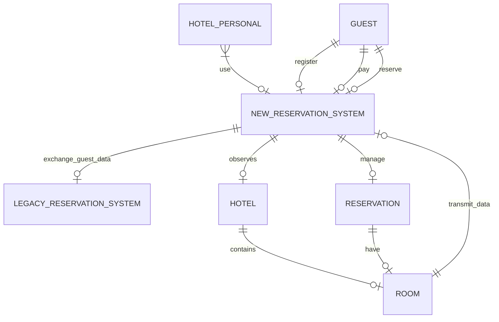

# 2. Subject-Area

Date: 2023-11-24

## Status

Утверждена

## Context

Составить модели предметной области

## Decision

Выделить акторы системы:

1. отели (гостиницы, курорты и спа-центры) 
2. система бронирования и управления
3. гость
4. номер (тип номера (стандартный, делюкс или люкс), фотографии, расположение, статус номера (забронирован, доступен, готов к уборке и т. д.),дата след бронирования,приоритета и необходимости бронирования).+ оснащен современной функциональностью управления уборкой
5. персонал отеля (менее 20)
6. персонал по уборке и техническому обслуживанию
7. запатентованные устройства, поставляемых компанией по бронированию, прикрепленных к тележкам для уборки
8. существующая системы бронирования (легаси поддерживает стандартные функции бронирования (например, платежи, регистрационная информация и т. д.))
9. канал бронирования: интернет, мобильный телефон, телефонный звонок или лично

## Consequences

на основе требований и описания сформированы акторы в проекте.

Выделим основные сущности

1. гость (GUEST)
2. номер (ROOM)
3. бронирование (RESERVATION)
4. система бронирования новая (NEW_RESERVATION_SYSTEM)
5. система бронирования старая (LEGACY_RESERVATION_SYSTEM)
6. персонал (HOTEL_PERSONAL)
7. отель (HOTEL)

опишем предметную область

